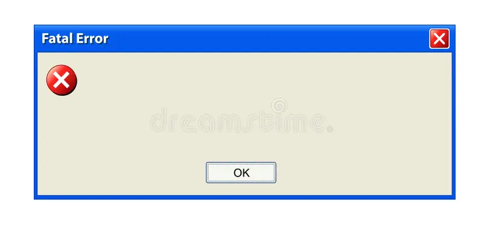

# 🗃️ DLL hijacking

**DLL hijacking** causes a lot of conflict in learning it. What is DLL? What is it used for? What is the purpose of hijacking a DLL and how to do it anyways?

All will be explained here.

***

## What is DLL?

DLL stands for **Dynamic Link Library**. DLL is like a public library, every person can come in a public library and get the book they need. The Dynamic Link Library is the same, but here, software comes to the DLL to get the shared code that it needs.

For example, a "windows pop up" is very popular and present in a lot of apps. Now why would every developer write the code for a windows OS pop up, when they can just use the DLL directly from the OS, that creates the blank popup window.

<figure><figcaption>
MessageBox() function - from user32.dll library
</figcaption></figure>

Because the DLL is loaded only when an application asks for it, and not every time the application starts, it does not fill up your ram memory. Which is a huge one.

Another positive thing about the DLL's is - not just one app can use one DLL, but multiple apps at the same time can borrow the same DLL.

Also, some DLL's are preinstalled in a windows OS , like the pop up windows we just mentioned, but also, third party applications can make their own DLL's that will be downloaded with the app. That is - if Microsoft lets them.

There was a problem in the earlier days of Microsoft where apps just created DLL's overwriting the defaults from Microsoft, and it made other apps crash on users PC's.\
Thats why, Microsoft locked the default DLL's from being able to be changed by third party apps, only if the app overwrites the default DLL in the Microsoft standard (which ensures that the DLL will work on all third party apps) will Microsoft allow the change of a default DLL by a third party software.

The whole sentance above sumarized is this:&#x20;

Microsoft protects the **system DLLs**. \
However, **user-space DLLs** (like app-specific DLLs) can still be hijacked if placed in directories like `%APPDATA%`, making them a common target.

...wow, that was a lot to take.

***

## DLL hijacking with payload

Now that we know what a DLL is, how can we abuse it for payloads?

Our scripting abilities + procmon (process monitor) + app that the victim has on their pc = successful payload execution.


Note: to do the exploitation explained below, you first need to gather inital access to your victims device. Once you have don that, you can do the part below.


• See what apps are often opened on the victim's PC.

• Download the same app same version on your device and use proc mem to see what DLL's on the app are missing.

• Write a payload.

• Move the payload in the missing DLL (Create a malicious DLL with the same name as the missing one and place it in the expected directory.)

• Experiment on your PC what .dll can be used because most will make the app crash.

• Once you get the one that works, on the victim PC do the same, write/copy the payload and move it in the selected DLL.

• Wait for the victim to execute the app or do it yourself if you are in a rush.

The benefit of this technique is that the payload can be a LOLBin. A file or binary that is "living of the land", meaning that the payload wont be treated as an external / malicious file, and the detection systems like an antivirus or IDS can't detect it.

Of course if your payload is modifying critical system components, it is not ,,living of the land,, because of the change that is needed for the payload to get to the final goal.

Hope this explanation helps you understand DLL and DLL hijacking. Love.
