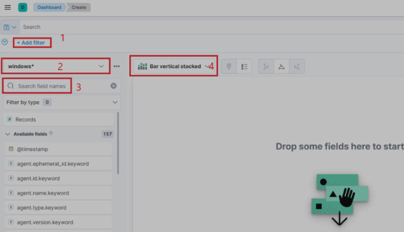

# SIEM visualization (5-8)

To create a new visualization we go on the drop menu and select "Dashboard" Click "Create Visualization"

A window opens with 4 important notices.

<figure><figcaption></figcaption></figure>

1. A filter option that allows us to filter the data before creating a graph. For example:
2. This field indicates the data set (index) that we are going to use. It is common for data from various infrastructure sources to be separated into different indices, such as network, Windows, Linux, etc. In this particular example, we will specify `windows*` in the "Index pattern".
3. This search bar provides us with the ability to double-check the existence of a specific field within our data set, serving as another way to ensure that we are looking at the correct data.
4. Lastly, this drop-down menu enables us to select the type of visualization we want to create.

***

### Filter Codes

#### Event Code

event.code: 4625 - Failed logon attempt on a Windows system. event.code: 4624 - An account was successfully logged on event.code: 4732: A member was added to a security-enabled local group event.code: 4733: A member was removed from a security-enabled local group

event.action.keyword – Specifies the type of action that occurred in the event, such as "logon" or "file modification

group.name - Used to specify a certain group name

winlog.event\_data.SubStatus: 0xC0000072 - the failure is due to a logon with disabled user. winlog.logon.type - Displays the logon type (RemoteInteractive, Wired, etc...) winlog.event\_data.MemberSid.keyword – Represents the Security Identifier (SID) of the user or group involved in the event

***

### Fields

user.name.keyword - account name host.name.keyword - device name winlog.logon.type.keyword - logon type (remote etc...) related.ip.keyword - the IP of the computer initiating the succsessful RDP logon attempt
