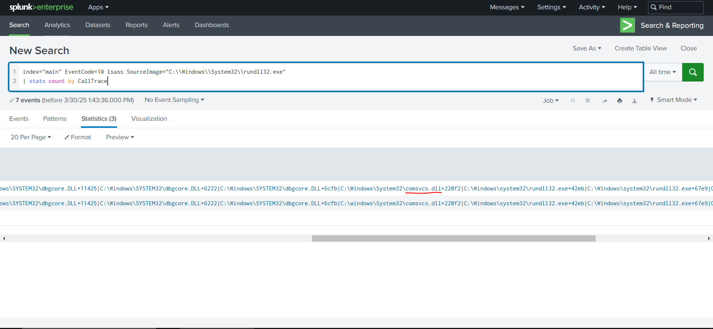

# Intrustion Detection with Splunk

## **Ingesting Data Sources**

The most imporant thing at the begining is to lower the volume of logs.

### Retrive all logs

```bash
index="main" earliest=0
```

***

## **Searching Effectively**

Some queries can take more time to load than others, although the returned lgos are the exact same. That is because if for example we specify to search for security logs and an EventCode that occurs only in security logs, and in another query we only specify the EventCode and not the source, we will get the same result, but splunk in the first example knows where to look, while in the second it looks through all the logs. Thus, taking more time to return the result of the query.


### listing all our sourcetypes

```shell
index="main" 
| stats count by sourcetype
```

<figure><figcaption></figcaption></figure>


### Query for all Sysmon logs

```shell
index="main" sourcetype="WinEventLog:Sysmon"
```

all possible instances of `uniwaldo.local` (Computer Name)

```shell
index="main" uniwaldo.local
```

all possible instances of `uniwaldo.local` using wildcards (takses more time)

```shell
index="main" *uniwaldo.local*
```

This search takes a lot of time because it searches for uniwaldo.local in all fields as a value. But we know its a computer name, so we can make it easyer for splunk by specifying the field.

all possible instances of `uniwaldo.local` using wildcards in ComputerName field

```shell
index="main" ComputerName="*uniwaldo.local"
```

***

## **Embracing The Mindset Of Analysts, Threat Hunters, & Detection Engineers**

1. **Sysmon Event Codes** provide detailed logging of system activities, useful for detecting anomalies.
2. **Parent-Child Process Relationships** can reveal malicious execution chains (e.g., `notepad.exe` spawning `powershell.exe`).
3. **DCSync Attack Detection** involves monitoring Active Directory replication events (`EventCode=4662` with `Access_Mask=0x100`).
4. **LSASS Dumping** can be detected using `EventCode=10` (Process Access) targeting `lsass.exe`.
5. **Efficient Searching** in Splunk involves:
   * Filtering by `sourcetype` and `EventCode` to reduce search time.
   * Using wildcards (`*`) carefully to avoid performance issues.
   * Specifying fields (e.g., `ComputerName`) instead of raw text searches.


### Listing All Sysmon EventCodes in the Dataset

```bash
index="main" sourcetype="WinEventLog:Sysmon" 
| stats count by EventCode
```

Identifies which Sysmon events are logged in the environment.

***

### Investigating Suspicious Parent-Child Processes

```
index="main" sourcetype="WinEventLog:Sysmon" EventCode=1 
| stats count by ParentImage, Image
```

Lists all process creation events with parent-child relationships.


### Filtering for High-Risk Processes (e.g., `cmd.exe`, `powershell.exe`)

```
index="main" sourcetype="WinEventLog:Sysmon" EventCode=1 
(Image="*cmd.exe" OR Image="*powershell.exe") 
| stats count by ParentImage, Image
```

Focuses on suspicious execution chains.


### Deep Dive into `notepad.exe` Spawning `powershell.exe`

```
index="main" sourcetype="WinEventLog:Sysmon" EventCode=1 
  (Image="*powershell.exe") ParentImage="C:\\Windows\\System32\\notepad.exe"
```

***

### Tracking Suspicious IP (`10.0.0.229`)

```
index="main" 10.0.0.229 
| stats count by sourcetype
```

Identifies all logs related to the suspicious IP.


### Investigating Linux Host (`waldo-virtual-machine`)

```
index="main" 10.0.0.229 sourcetype="linux:syslog"
```

Checks if the Linux system is involved in malicious activity.


### Finding Malicious Commands from the IP

```
index="main" 10.0.0.229 sourcetype="WinEventLog:sysmon" 
| stats count by CommandLine, host
```

Lists commands executed on Windows hosts from the suspicious IP.

***

### Detecting DCSync Attacks (Active Directory Compromise)

```
index="main" EventCode=4662 Access_Mask=0x100 Account_Name!=*$ 
| table _time, Account_Name, Object_Type, Properties
```

Identifies potential DCSync attempts (replication of AD secrets).

***

### Detecting LSASS Dumping (Credential Theft)

```
index="main" EventCode=10 lsass 
| stats count by SourceImage
```

Lists processes accessing `lsass.exe` (common in credential dumping).


### Investigating Suspicious `notepad.exe` Accessing LSASS

```
index="main" EventCode=10 lsass SourceImage="C:\\Windows\\System32\\notepad.exe"
```

Checks if Notepad is being used to dump credentials (highly suspicious).

***

### **Key Takeaways**

1. **Start Broad, Then Narrow Down**
   * Begin with general queries (e.g., all Sysmon events), then filter for anomalies.
2. **Focus on High-Value EventCodes**
   * `EventCode=1` (process creation), `EventCode=10` (process access), and `EventCode=4662` (AD replication) are critical for detecting intrusions.
3. **Correlate Suspicious Activity**
   * Combine process anomalies (`notepad.exe` → `powershell.exe`) with network connections (`10.0.0.229`) to uncover attack chains.
4. **Validate Findings**
   * Use additional queries (e.g., `Access_Mask=0x100` for DCSync) to confirm malicious activity.
5. **Optimize Searches**
   * Specify `sourcetype` and fields (e.g., `ComputerName`) to speed up queries.

***

## **Creating Meaningful Alerts**

### **Key Concepts**

1. **Alerting vs. Hunting**
   * **Alerting**: Proactive detection with low false positives.
   * **Hunting**: Exploratory analysis to uncover hidden threats.
   * **Goal**: Avoid alert fatigue by minimizing noise while catching real threats.
2. **Detecting Malicious API Calls from UNKNOWN Memory Regions**
   * Shellcode often executes from **unbacked memory** (UNKNOWN in call stacks).
   * Legitimate processes (e.g., JIT compilers) may also trigger UNKNOWN calls (false positives).
3. **Optimizing Alerts**
   * **Exclude known benign processes** (e.g., `.NET`, `Explorer.exe`, `WOW64`).
   * **Focus on high-risk behaviors** (e.g., `ProcessAccess` with `UNKNOWN` call traces).
   * **Ensure resilience** against evasion (e.g., attackers renaming DLLs to bypass filters).

***

### 1. Identify All Call Traces with "UNKNOWN" (Shellcode Indicator)\*\*

```
index="main" CallTrace="*UNKNOWN*" 
| stats count by EventCode
```

* **Purpose**: Find which `EventCode` logs contain suspicious memory calls.
* **Observation**: Only `EventCode=10` (Process Access) is relevant here.

***

### **2. Group Suspicious Calls by Source Process**

```
index="main" CallTrace="*UNKNOWN*" 
| stats count by SourceImage
```

* **Purpose**: Identify processes making unbacked memory calls.
* **Common False Positives**:
  * `.NET` (JIT compilation).
  * Electron apps (`Squirrel.exe`).
  * `WOW64` (Windows 32-bit emulation).

***

### **3. Filter Out Self-Accessing Processes**

```
index="main" CallTrace="*UNKNOWN*" 
| where SourceImage!=TargetImage 
| stats count by SourceImage
```

* **Purpose**: Ignore processes accessing themselves (often benign).

***

### 4. Exclude Known Benign Processes (JIT, .NET, WOW64)

```
index="main" CallTrace="*UNKNOWN*" 
  SourceImage!="*Microsoft.NET*" 
  CallTrace!=*ni.dll* 
  CallTrace!=*clr.dll* 
  CallTrace!=*wow64* 
  SourceImage!="C:\\Windows\\Explorer.EXE" 
| where SourceImage!=TargetImage 
| stats count by SourceImage
```

* **Purpose**: Remove noise from legitimate applications.
* **Key Exclusions**:
  * `.NET` (`clr.dll`, `ni.dll`).
  * `WOW64` (32-bit emulation).
  * `Explorer.exe` (too noisy).

***

### **5. Final High-Fidelity Alert Query**

```
index="main" CallTrace="*UNKNOWN*" 
  SourceImage!="*Microsoft.NET*" 
  CallTrace!=*ni.dll* 
  CallTrace!=*clr.dll* 
  CallTrace!=*wow64* 
  SourceImage!="C:\\Windows\\Explorer.EXE" 
| where SourceImage!=TargetImage 
| stats count by SourceImage, TargetImage, CallTrace
```

* **Purpose**: Detect **only** suspicious process access from unbacked memory.
* **Output**:
  * `SourceImage` (malicious process).
  * `TargetImage` (process being accessed, e.g., `lsass.exe`).
  * `CallTrace` (full API call stack).

***

## Tasks

### task1

Navigate to http://\[Target IP]:8000, open the "Search & Reporting" application, and find through an SPL search against all data the other process that dumped lsass. Enter its name as your answer. Answer format: \_\_\_\_\_.exe

```spl
index="main" EventCode=10 lsass SourceImage="C:\\Windows\\System32\\notepad.exe"
```

<figure><figcaption></figcaption></figure>

**Answer: ntdll.dll**

***

### task2

&#x20;Navigate to http://\[Target IP]:8000, open the "Search & Reporting" application, and find through SPL searches against all data the method through which the other process dumped lsass. Enter the misused DLL's name as your answer. Answer format: \_\_\_\_\_\_.dll

```spl
index="main" EventCode=10 lsass SourceImage="C:\\Windows\\System32\\rundll32.exe"
| stats count by CallTrace
```

<figure><figcaption></figcaption></figure>

**answer: comsvcs.dll**

***

### task3

Navigate to http://\[Target IP]:8000, open the "Search & Reporting" application, and find through an SPL search against all data any suspicious loads of clr.dll that could indicate a C# injection/execute-assembly attack. Then, again through SPL searches, find if any of the suspicious processes that were returned in the first place were used to temporarily execute code. Enter its name as your answer. Answer format: \_\_\_\_\_\_.exe

```
index="main" EventCode=7 ImageLoaded="*clr.dll" 
| stats count by Image
```

**Answer: rundll32.exe**

***

### task4

&#x20;Navigate to http://\[Target IP]:8000, open the "Search & Reporting" application, and find through SPL searches against all data the two IP addresses of the C2 callback server. Answer format: 10.0.0.1XX and 10.0.0.XX

```
index="main" sourcetype="WinEventLog:Sysmon" EventCode=3 Image="C:\\Windows\\system32\\notepad.exe" 
| stats values(DestinationIp) as destination_ips
```

**Answer: 10.0.0.186 and 10.0.0.91**

***

### task5

Navigate to http://\[Target IP]:8000, open the "Search & Reporting" application, and find through SPL searches against all data the port that one of the two C2 callback server IPs used to connect to one of the compromised machines. Enter it as your answer.

```spl
index="main" sourcetype="WinEventLog:Sysmon" EventCode=3 (SourceIp="10.0.0.186" OR SourceIp="10.0.0.91")
| stats count by DestinationPort
```

<figure><figcaption></figcaption></figure>

**Answer: 3389**
