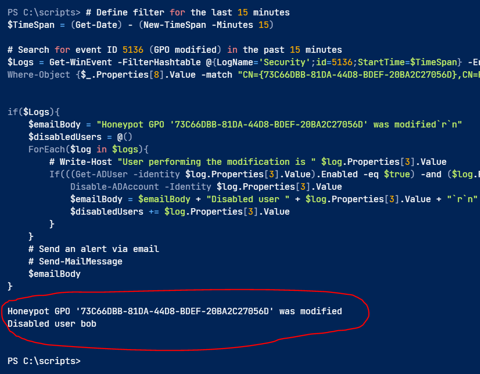

# GPO

* **GPO (Group Policy Object)** = virtual collection of policy settings with a unique name.
* Used to manage configuration in **Active Directory**.
* Linked to **OUs (Organizational Units)**; affects objects in that OU and child OUs.
* By default, GPOs apply to **Authenticated Users**.
* Can be filtered by **AD groups** or **WMI filters** (e.g., only Windows 10 machines).
* Only **Domain Admins** (or similar roles) can modify GPOs by default.
* **Delegation** can allow lower-privileged users to edit GPOs.
* If a GPO can be edited by normal users, attackers can:
  * Add **startup scripts**
  * Add **scheduled tasks**
  * Compromise many computers in affected OUs
* **GPOs used for software installs or scripts** may use files from **network shares**.
* If network share or file permissions (NTFS) are weak, attackers can:
  * Replace legitimate files with **malicious ones**
  * Gain system-level access even if GPO is secure

***

## Attack

Simple GPO edit or file replacement

***

## Prevention

* Lock down GPO permissions, only specific account can edit it
* Dont deploy shared files that many users can modify

***

## Detection

Fortunately, it is straightforward to detect when a GPO is modified. If Directory Service Changes auditing is enabled, then the event ID `5136` will be generated

From a defensive point of view, if a user who is `not` expected to have the right to modify a GPO suddenly appears here, then a red flag should be raised.

***

## Honeypot

* Some orgs leave **misconfigured GPOs** on purpose to detect attacks.
* Works **only if** the org is **mature** and can respond **immediately**.
* Otherwise, it can become a **weak spot** if abused before detection.

**Honeypot Setup**

* Link honeypot GPO to **non-critical servers** only.
* **Monitor continuously** for changes (e.g., every 15 minutes).
* If GPO is modified:
  * **Disable** the user(s) who made the change.
  * **Unlink** GPO from all OUs to stop the attack path.
* Use PowerShell to **automate detection + response**.

**Powershell Script**

* Looks for **event ID 5136** (GPO modified) in the **last 15 minutes**.
* Checks if the modification was on the **honeypot GPO** (by GUID).
* For each modifying user:
  * If user is enabled → **disable account immediately**.
* Optional: Send **email alert** (Send-MailMessage).
* Displays output with disabled usernames (e.g., `Disabled user bob`).
* Disabling the user generates **event ID 4725** (account disabled).

How the script looks:

<figure><figcaption></figcaption></figure>
