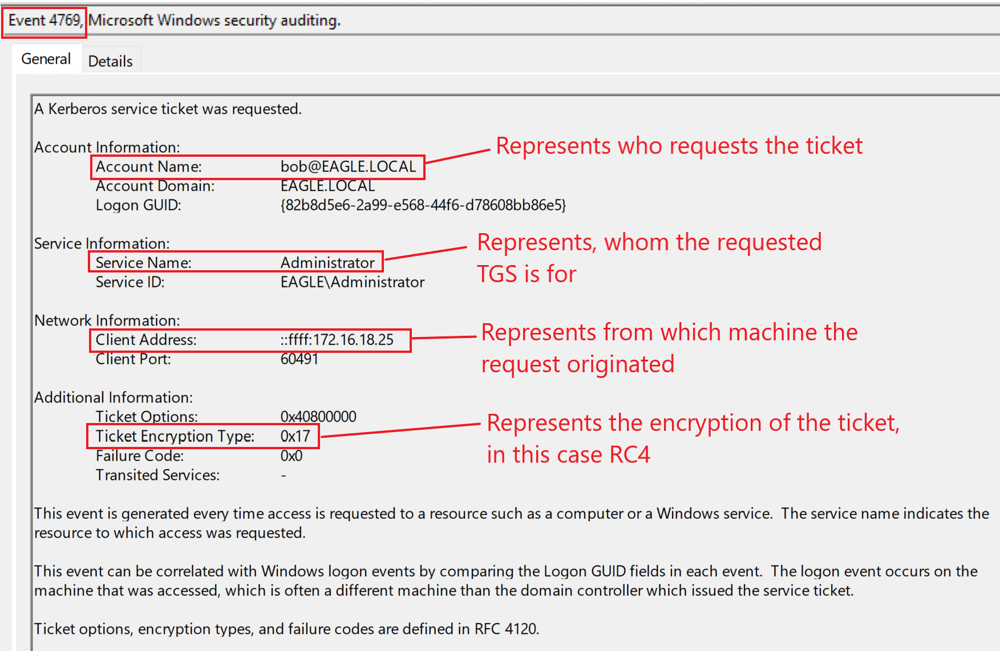

# Kerberoasting

## **Description**

In **Active Directory**, a **Service Principal Name (SPN)** is a unique identifier that links a service to its service account. **Kerberos authentication** relies on SPNs to verify users and services without needing the exact account name.

When a **TGS (Ticket Granting Service) ticket** is requested, it gets encrypted using the service account's **NTLM password hash**. Attackers can abuse this by requesting service tickets and then attempting **offline password cracking** on them. If the password is weak and successfully cracked, the attacker gains access to the **service account**.

The strength of this attack depends on two factors:

* The **complexity of the service account password**
* The **encryption algorithm used** for the ticket

### **Encryption Algorithms & Cracking Speed**

* **AES** → Strongest, slowest to crack
* **RC4** → Weaker, faster to crack
* **DES** → Very outdated, rarely enabled unless legacy apps require it

While **security best practices** recommend disabling **RC4 and DES**, many environments still use **RC4** due to compatibility issues with some applications. Attackers can also **force a downgrade** to RC4, making cracking easier.

### **Key Takeaways:**

* Kerberoasting targets **service accounts** by cracking their password from **Kerberos tickets**.
* The attack works **offline**, meaning **no failed login attempts** appear in logs.
* **Strong passwords** and **restricting SPN exposure** help mitigate the risk.
* **Disabling RC4 & DES** makes Kerberoasting significantly harder.

***

## **Attack Path**

To obtain crackable tickets, we can use [Rubeus](https://github.com/GhostPack/Rubeus). When we run the tool with the `kerberoast` action without specifying a user, it will extract tickets for every user that has an SPN registered (this can easily be in the hundreds in large environments)

Remember, these attack is performable only when we get the initial access to the WS.

### Extracts all kerberoastable tickets from WS

```powershell-session
.\Rubeus.exe kerberoast /outfile:spn.txt
```

We will get the output in a file called "son.txt"\
We then need to move the extracted file with the tickets to the Kali Linux VM for cracking.

### Cracking the tickets

```shell-session
hashcat -m 13100 -a 0 spn.txt passwords.txt --outfile="cracked.txt"
```

Back on our kali, we can use `hashcat` with the hash-mode (option `-m`) `13100` for a `Kerberoastable TGS`. We also pass a dictionary file with passwords (the file `passwords.txt`) and save the output of any successfully cracked tickets to a file called `cracked.txt`

If `hashcat` gives an error, we may need to pass `--force` as an argument at the end of the command.

Once `hashcat` finishes cracking, we can read the file 'cracked.txt' with cat command

### Cracking the tickets with john

```shell-session
sudo john spn.txt --fork=4 --format=krb5tgs --wordlist=passwords.txt --pot=results.pot
```

***

## Prevention

* limit the number of accounts with SPNs
* Disable the ones not in use
* When in doubt, do not assign SPNs to accounts that do not need them
* Strong service account's password (100 letters, max is 127)
* Use GMSA service accounts

**GMSA** ( [Group Managed Service Accounts](https://learn.microsoft.com/en-us/windows-server/security/group-managed-service-accounts/group-managed-service-accounts-overview)) is a special type of **service account** that **Active Directory manages automatically**. These accounts are

* bound to a specific server (cant be accessed from no other device)
* Automatically rotate password (127char in length)

The downside is that **not all applications support GMSA**. They mainly work with **Microsoft services (IIS, SQL)** and a few other compatible apps.\
Despite this, we should **use GMSA whenever possible**

***

## Detection

* When a TGS is requested, an event log with ID `4769` is created.
* However, AD also generates the same event ID whenever a user attempts to connect to a service, which means that the volume of this event is gigantic
* If **only AES tickets** are used, an **RC4 ticket request** (ID 4769) is a red flag.
* **RC4 tickets** should not be generated by default—if they are, investigate immediately.


<figure><figcaption></figcaption></figure>


* A big warning sign: **If someone requests 10+ tickets in a minute** (or even less).
* To catch attackers, track:
  1. **Which user** is making the requests.
  2. **Which computer** the requests are coming from.

***

## Honeypot

A `honeypot user` is a perfect detection option to configure in an AD environment; this must be a user with **no real use/need in the environment**, so no service tickets are generated regularly. In this case, any attempt to generate a service ticket for this account is likely malicious and worth inspecting.

There are a few things to ensure when using this account:

* **Old accounts** → Best if unused or forgotten (hackers avoid new accounts).
* **Passwords not changed recently** → At least **2+ years old**, ideally **5+ years**.
* **Has some privileges** → Needs to be important enough for hackers to care.
* **Has a legit SPN** → Common ones like **IIS or SQL service accounts** work best.

***

## Tasks

### Task 1

&#x20;**RDP to 10.129.234.79 (ACADEMY-WINATTKDEF-WS01) with user "bob" and password "Slavi123"**

**Connect to the target and perform a Kerberoasting attack. What is the password for the svc-iam user?**

This task has to be done on a linux machine, the htb creators want you to use the commands provided for the xfreerdp.

Connect to the WS01:

```
xfreerdp /v:10.129.234.79 /u:bob /p:Slavi123 /dynamic-resolution
```

Open powershell in the WS01 and use the rubeus app that is in the downloads file.

<figure><figcaption></figcaption></figure>


Put the spn.txt file (that is in downloads) in the file called "Share" that is also pre-made in the downlaods folder.

Back to our linux machine, smb using the provided info we got a the task description.\
And use the get command to download the spn.txt

<figure><figcaption></figcaption></figure>


Use hashcat as explained in the lesson, i just used "rockyou.txt" as a dictionary (coundnt find the password.txt).\
And cat in the output file.

<figure><figcaption></figcaption></figure>

**Answer: mariposa**

***

### Task 2

RDP to the ip addres provided in the task (you can do this on a windows machine)

<figure><figcaption></figcaption></figure>

Open EventView and filter the event ID 4769 in the Security logs.\
Try different logs, you are searching for the ServideSid that is in the "details"

**Answer: S-1-5-21-1518138621-4282902758-752445584-2110**
