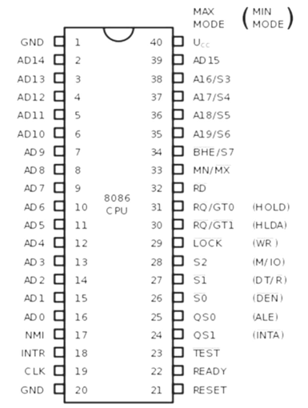

# Intel 8086 Architecture

## High level Overwiev

* It lunched in 1979
* It was the first 16-bit microprocessor
* and it has 40 pins
* it uses +5v powersupply
* has \~29.000 transistors (semiconductors)
* has up to 1MB memory, witch is a lot for what it is used.
* Memory address ranges from 00000(16) to FFFFF(16)
* little-endian organization

**Mem organization**

<figure><figcaption></figcaption></figure>

**Pins**

<figure><figcaption></figcaption></figure>

***

## Block Diagram

<figure><figcaption></figcaption></figure>

Two main units of the 8086 processor:&#x20;

* **BIU** – Bus Interface Unit Fetching instructions from memory and decoding them Manages the data transfer between the microprocessor and the memory or I/O devices (I/O – Input/Output) Provides a full 16-bit bi-directional data bus and 20-bit address bus
* **EU** – Execution Unit Executes the instructions

***

### BIU (Bus Interface Unit)

The **BIU** is responsible for handling all data transfers between the **CPU** and **memory** or **I/O devices**. It does this by managing the **B-bus** and **C-Bus** 

**BIU Contains:**&#x20;

* [Instruction Queue](intel-8086-architecture.md#instruction-queue)
* [Segment Registers](intel-8086-architecture.md#segment-registers)
* [Instruction Pointer (IP)](intel-8086-architecture.md#instruction-pointer-ip)
* [Address Summer](intel-8086-architecture.md#address-summer)
* Bus control Logic

**So how the BIU works is:** \
It captures **six instruction bytes** ahead of its current memory, and the instructions a re stored in a Queue (group of registers). And the Queue has FIFO organization, whitch means if MOV command is written first and than ADD, the MOV will be executed first, bcs it was first written-first queued.

JMP and CALL functions are not used when loaded but when they are called, and other instructions ate loaded extend them

Feature of fetching the next instruction while the current instruction is executing is called **pipelining**

***

#### Segment Registers

<figure><figcaption></figcaption></figure>

**Segment registers** are a set of **16-bit registers** in x86 processors that hold the **base addresses of memory segments**.

Segment registers are essential for **memory segmentation** in 16-bit processors, allowing the CPU to access a 1 MB memory space with 16-bit addresses

Each segment register contains starting address of a segment (called also: Base address or Segment base)

**Memory Segmentation**

<figure><figcaption></figcaption></figure>

**Memory segmentation** is a memory management technique used in computer systems, especially in early processors like the Intel 8086, to divide memory into distinct **segments**. Each segment represents a logical section of memory with a specific purpose, which helps organize data, code, and the stack, allowing for more efficient memory access and usage. Segmentation enables the CPU to access a **larger memory space** than it could with a single flat address space.

Memory segmentation allows memory addressing capacity to be 1mb .

***

Internal architecture of 8086 allows usage of 4 active segments with the help of the following four segment registers:

* CS - Code Segment&#x20;
* DS - Data Segment
* SS - Stack Segment
* ES - Extra Segment 

<figure><figcaption></figcaption></figure>

***

#### Address Summer

<figure><figcaption></figcaption></figure>

<figure><figcaption></figcaption></figure>

* The **CS** register holds the upper 16-bits of the starting address of the segment from which the BIU is currently fetching the instruction code byte.
* The **SS** register is used for the upper 16-bits of the starting address for the program stack
* **ES** register and **DS** register are used to hold the upper 16-bits of the starting address of the two memory segments, which are used for data.

***

#### Instruction Pointer (IP)

The instruction pointer register holds the 16-bit address of the next Code byte within the code segment. The value contained in the IP is referred to as an **offset**.

This value must be offset from (added to) the segment base address in CS to produce the required 20-bit physical address.

<figure><figcaption></figcaption></figure>

***

#### Instruction Queue

The **instruction queue** is a buffer that holds a **6-byte queue** of instructions. This prefetches instructions from memory to reduce the time the processor waits for instructions, allowing faster execution.

***

### **EU (Execution Unit)**

The execution unit tells the BIU from where to fetch instructions or data. Decodes instructions and executes instructions.

It contains:

* [Control Circuity](intel-8086-architecture.md#control-circuitry-instruction-decoder-alu)
* Instruction Decoder
* Arithmetic Logic Unit (ALU)
* [Flag Register](intel-8086-architecture.md#flag-register)
* [General Purpose Registers](intel-8086-architecture.md#general-purpose-registers)
* Pointers and Index Registers

***

#### Control Circuitry, Instruction Decoder, ALU:

▪ The control circuitry in the EU directs the internal operations. ▪ A decoder in the EU translates the instructions fetched from memory into a series of actions which the EU performs. ▪ ALU is 16-bit. It can add, subtract, AND, OR, XOR, increment, decrements, complement and shift binary numbers.

!\[\[Control Circuit, Instruction Decoder, ALU.png]]

<figure><figcaption></figcaption></figure>

***

#### Flag Register

▪ A special purpose 16-bit register. ▪ There are 9 valid flag bits. ▪The flag bits are changed to 0 or 1 depending on the value of result after arithmetic or logical operations. ▪ The flag bits can be divided into two sections – control flags and status flags

<figure><figcaption></figcaption></figure>

<figure><figcaption></figcaption></figure>

<table><thead><tr><th width="260">Flag</th><th>Bit.</th><th>Description</th></tr></thead><tbody><tr><td>CF (Carry Flag)</td><td>0</td><td>Set if an arithmetic operation generates a carry out or borrow into the most significant bit</td></tr><tr><td>PF (Parity Flag)</td><td>2</td><td>Set if the result of an operation has an even number of 1-bits; used for error checking</td></tr><tr><td>AF (Auxiliary Carry Flag)</td><td>4</td><td>Set if there is a carry or borrow between the lower and upper nibbles (used in BCD arithmetic)</td></tr><tr><td>ZF (Zero Flag)</td><td>6</td><td>Set if the result of an operation is zero</td></tr><tr><td>SF (Sign Flag)</td><td>7</td><td>Set if the result of an operation is negative (most significant bit is 1).</td></tr><tr><td>TF (Trap Flag)</td><td>8</td><td>Enables single-step mode for debugging, causing an interrupt after each instruction</td></tr><tr><td>IF (Interrupt Flag)</td><td>9</td><td>Controls the ability to respond to interrupts; if set, the CPU will respond to maskable interrupts</td></tr><tr><td>DF (Direction Flag)</td><td>10</td><td>Controls the ability to respond to interrupts; if set, the CPU will respond to maskable interruptst</td></tr><tr><td>OF (Overflow Flag)</td><td>11</td><td>Set if an arithmetic operation generates a result too large to fit in the destination operand</td></tr></tbody></table>

***

#### General Purpose Registers

* 8 general purpose registers (8-bits each) labelled: AH, AL, BH, BL, CH, CL, DH, and DL.
* Can be used individually for temporary storage of 8-bit data.
* The AL register is also called accumulator.
* Certain pairs of these general-purpose registers can be used together to store 16-bit data, such as AX, BX, CX and DX.

<figure><figcaption></figcaption></figure>

***

### Instruction Set

Intel 8086 microprocessor supports 8 types of instructions:&#x20;

* Data Transfer Instructions
* Arithmetic Instructions&#x20;
* Bit Manipulation Instructions
* String Instructions&#x20;
* Program Execution Transfer Instructions (Branch & Loop Instructions)&#x20;
* Processor Control Instructions ▪ Iteration Control Instructions&#x20;
* Interrupt Instructions

***

#### MOV

copies the second operand (source) to the first operand (destination)

**Syntax:**&#x20;

MOV operand1, operand2\
(destionation) (source)

**Important:**&#x20;

* Never mix an 8-bit register with 16-bit, it is not allowed.
* Code segment register (CS) and Instruction Pointer (IP) are never used as destination.&#x20;
* Segment with segment is not allowed.&#x20;
* Memory with memory is not allowed.&#x20;
* When used immediate with memory you must use (byteptr) of&#x20;
* 8-bit or (wordptr) of 16-bit for the instructions.&#x20;
* Also used for the instructions have one operand as memory

**Example 1:** \
mov ES, DS (Incorrect)\
\
mov AX, DS \
mov ES, AX (correct)

Example 2: \
mov \[SI],\[0xF900]         (Incorrect)\
\
mov BX, \[0xF900] \
mov \[SI], BX                     (correct)
