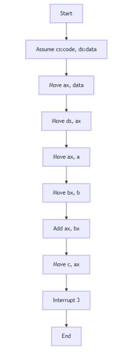

# Addition of two 16-bit numbers



```
data segment 
a dw 0202h
b dw 0408h
c dw ?
data ends


code segment
assume cs:code, ds:data
start:

mov ax, data
mov ds, ax
mov ax, a 
mov bx, b
add ax, bx
mov c, ax

int 3

code ends
end start
```



<figure><figcaption></figcaption></figure>




## Understand the code

### Data Segment&#x20;

<mark style="color:yellow;">**a dw 0202h**</mark>: This line declares a 16-bit word variable named a and initializes it with the hexadecimal value 0202.&#x20;

<mark style="color:yellow;">**b dw 0408h**</mark>: Similarly, this declares a 16-bit word variable b and initializes it with the hexadecimal value 0408.&#x20;

<mark style="color:yellow;">**c dw ?**</mark>: This declares a 16-bit word variable c but does not initialize it. It will store the result of the addition operation.

### Code Segment&#x20;

<mark style="color:yellow;">**mov ax,data**</mark>**:** This instruction moves the address of the data segment into the AX register.

**mov ds,ax**: This sets the Data Segment (DS) register to the value in AX, effectively making the data segment accessible for data operations.

<mark style="color:yellow;">**mov ax,a**</mark>**:** This moves the value of a (0202h) into the AX register.

<mark style="color:yellow;">**mov bx,b**</mark>**:** This moves the value of b (0408h) into the BX register.

<mark style="color:yellow;">**add ax,bx**</mark>**:** This adds the contents of BX to the contents of AX. The result (060Ah) is stored in AX. ; mov c,ax: This moves the result from AX to the variable c.&#x20;

<mark style="color:yellow;">**int 3**</mark>**:** This is a breakpoint instruction that causes the program to halt, allowing for debugging and inspection of registers and memory.

### Overall Functionality&#x20;

The code performs the following steps:&#x20;

<mark style="color:yellow;">**Initialization**</mark>**:** Sets up the data segment and initializes variables a and b. ; Addition: Loads the values of a and b into registers AX and BX, respectively. Adds the two values and stores the result in AX.

<mark style="color:yellow;">**Result Storage**</mark>**:** Stores the result from AX into the variable c.&#x20;

<mark style="color:yellow;">**Program Termination**</mark>**:** Halts the program execution using the int 3 instruction.&#x20;

In essence, this code adds two 16-bit hexadecimal numbers (0202h and 0408h) and stores the result (060Ah) in the variable c.

