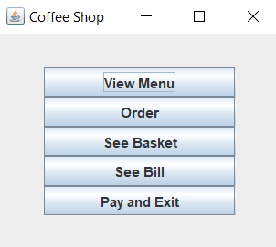

# SWING

To start building our GUI with swing we first import it:

```java
import javax.swing.*
```

While at it, we can import a few more useful packages and classes that we will use:

```java
import java.awt.event.ActionEvent;
import java.awt.event.ActionListener;
```

`java.awt.*` contains classes for creating GUI components like buttons, windows etc.

`java.awt.event.ActionEvent` classrepresents an action event that happens when a user interacts with a GUI component, like clicking a button.

`java.awt.event.ActionListener` interface is used to handle such action events. When a component, such as a button, generates an action event, the ActionListener's **`actionPerformed`** method is called. This method contains the code that responds to the event, allowing you to define what should happen when the user interacts with the component.

So when import what we need, under the class line we should create the following objects witch are used for creating the GUI window. All of this objects have to be used for a GUI.

The objects that can be used for creating a simple GUI with swing are JFrame, JPanel, JButton, JLabel.

```java
public class CoffeeShopGUI
    static private JFrame frame;
    static private JPanel panel;
    static private JButton viewMenuButton;
    static private JButton orderButton;
    static private JButton seeBasketButton;
    static private JButton seeBillButton;
    static private JButton payAndExitButton;
```

Here, frame is the window, panel is a box in the window that holds the buttons, and a button is a button🙂 A good practice is to call the objects like this at the top of the class, and use private and static.

Next thing to remember is that everything related to the window settings is written in the java constructor of the class, because the constructor is where you initialize the frame and set its properties before making it visible.

## **Window Setting-up**

```java
public CoffeeShopGUI() {
				//creating the frame object
        frame = new JFrame();
        //creating the panel object
        panel = new JPanel();

				//creating the buttons objects with text on the buttons
        viewMenuButton = new JButton("View Menu");
        orderButton = new JButton("Order");
        seeBasketButton = new JButton("See Basket");
        seeBillButton = new JButton("See Bill");
        payAndExitButton = new JButton("Pay and Exit");
```

```java
        viewMenuButton.addActionListener(this);
        orderButton.addActionListener(this);
        seeBasketButton.addActionListener(this);
        seeBillButton.addActionListener(this);
        payAndExitButton.addActionListener(this);
```

In this code snippet, **`this`** refers to the current object, which is assumed to implement the **`ActionListener`** interface. The **`addActionListener`** method is used to register the current object as an action listener for multiple buttons.

When a button is clicked, an action event is generated, and the **`actionPerformed`** method of the action listener (in this case, the current object) is called. By registering the current object as the action listener for multiple buttons, you can handle the action events from these buttons in a single **`actionPerformed`** method, which can differentiate between the buttons based on the event source.

```java
        panel.setBorder(BorderFactory.createEmptyBorder(30, 40, 30, 40));
        panel.setLayout(new GridLayout(0, 1));
        panel.add(viewMenuButton);
        panel.add(orderButton);
        panel.add(seeBasketButton);
        panel.add(seeBillButton);
        panel.add(payAndExitButton);
```

Here the buttons are added to the panel, dont mind the first 2 rows i dont getthe mesurements as well, saw a lot of people just writing this numbers.

```java
        //add the panel in the center of the frame
        frame.add(panel, BorderLayout.CENTER);
        //Some exit settings
        frame.setDefaultCloseOperation(JFrame.EXIT_ON_CLOSE);
        //set title
        frame.setTitle("Coffee Shop");
        //always write this dunno why
        frame.pack(); 
        //make the window visable on screen
        frame.setVisible(true);
```

## **Functionality**

```java
    public static void main(String[] args) {
        new CoffeeShopGUI();
```

In the main method of the GUI create a new constructor.

```java
    public void actionPerformed(ActionEvent e) {
        String action = e.getActionCommand();
```

The **`actionPerformed`** method is called when an action event occurs, such as a button click. It takes an **`ActionEvent`** parameter (**`e`**), which provides information about the event. The **`getActionCommand()`** method of the **`ActionEvent`** class retrieves the command string associated with the event, which is often the text displayed on a button or the action command set for other components. This allows you to determine which component triggered the event and take appropriate action based on that information.

Now we can use a **`switch`** statement to call the appropriate function depending on what the user clicks.

```java
   public void actionPerformed(ActionEvent e) {
        String action = e.getActionCommand();

        switch (action) {
            case "View Menu":
                displayMenu();
                break;
            case "Order":
                order();
                break;
            case "See Basket":
                displayBasket();
                break;
            case "See Bill":
                displayTotalPrice();
                break;
            case "Pay and Exit":
                payAndExit();
                break;
            default:
                break;
        }
    }

```

the last thing left is to use the object from the main coffee shop code and call the functions that we defined from there.

```java
private void displayMenu() {
        CoffeeShop.displayMenu();
    }

    private void order() {
        Scanner input = new Scanner(System.in);
        CoffeeShop.order(input);
        input.close();
    }

    private void displayBasket() {
        CoffeeShop.displayBasket();
    }

    private void displayTotalPrice() {
        CoffeeShop.displayTotalPrice();
    }

    private void payAndExit() {
		    //pop-up message window
        JOptionPane.showMessageDialog(frame, "Payment received! Thank you for visiting Mladen's Coffee Shop!");
        System.exit(0);
    }
}

```

And like that, using swing we made our simple GUI for our Coffe Shop.

<figure><figcaption></figcaption></figure>

***

## **CheetSheets**

<details>

<summary><strong>Window</strong></summary>

Creating the window of the GUI in swing is done with JFrame.

```java
JFrame frame = new JFrame(); //create frame object 
frame.setSize(350,200) //width and height of the window 
frame.setTitle(”Title”) //Set a title above the window frame.setDefaultCloseOperation(JFrame.*EXIT_ON_CLOSE*); //exit the window when ‘x’ is pressed 
frame.add(panel); //add objects to the frame like button, panels, labels 
frame.setVisible(true); //set the frame visible, always put this on end of gui code
```


</details>

<details>

<summary><strong>Panel</strong></summary>

Panel is the place where we put button, labels… And is created with JPanel.

```java
JPanel panel = new JPanel(); //create panel object 
panel.setLayout(null); //creates the panel as big as the frame 
panel.add(button); //add’s an object to the panel
```

</details>

<details>

<summary>Button</summary>

Buttons take action when clicked thanks to the ActionListener and perform specific task defined in the ActionListener method, and its created with JButton.

```java
private static JButton *button* //Creates button object 
button = new JButton(”text on button”) //create button and add text on it 
Button.setBounds(140, 90, 80, 25); //button coordinates and dimension (x, y, width, height) the 0 on the axis is in top left 
Button.addActionListener(new *class name*()); //add function to button when clicked 
public class loginPage implements ActionListener { //this needs to be added to the class to act as a ActionListener 
panel.add(button); //add the button to the panel on the defined coordinates
```

</details>

<details>

<summary><strong>Label</strong></summary>

Label is a field where we can put some text or pictures on the panel, and is created with JLabel.

```java
private static JLabel label; //Creates 
label object label = new JLabel(); /create label and add text to it 
label.setBounds(20, 20, 80, 25); //label coordinates and dimension (x, y, width, height) the 0 on the axis is in top left 
label.setHorizontalAlignment(SwingConstants.*CENTER*); //set the label coordinate 0 in center
label.setText(”some text”) //mesage printed on the label label.setFont(new Font("Arial", Font.*BOLD*, 24)); //set the font and size for the label 
label.setIcon(image_variable_name); //place a image in the label 
panel.add(label); //add label to the panel on defined coordinates
```

</details>

<details>

<summary><strong>Text Input Box</strong></summary>

Text box is a box in whitch you can write anything. And it is created with the JTextField.

```java
private static JTextField userText; //text input field object 
userText = new JTextField(); //create the field 
userText.setBounds(100, 20, 165, 25); //text field coordinates and dimension (x, y, width, height) the 0 on the axis is in top left 
userText.getText(); //get input in the field by user
```

</details>

<details>

<summary><strong>Password Input Box</strong></summary>

Password box is a box in whitch you can write anything but the difference is that dots are displayed insead of the letters. This is thanks to the java developers that created the swing library and the JpasswordField method that we used. And yeah, it is created with the JPasswordField.

```java
private static JPasswordField pass Text; //password (dots) input field object 
passText = new JPasswordField(); //create the field pass
Text.setBounds(100, 20, 165, 25); //text field coordinates and dimension (x, y, width, height) the 0 on the axis is in top left
```


</details>

<details>

<summary><strong>Image</strong></summary>

Images can be added using swing using the JLabel objects and with this command: _label.setIcon(ImageIcon variable name that holds the image path)_

```
static ImageIcon variable_name = new ImageIcon("C:\\Image\\Path\\image.pn");
```

</details>

