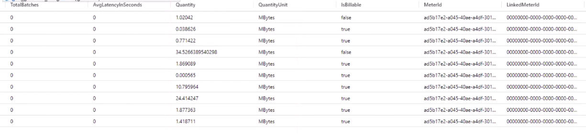

# search | extend | getschema

### search

the search command searches the whole table, not specific fields.

It can also search whole databases.

It takes a lot of resources. Thats why search is best used with a specific timeframe defined using\
`| where TimeGenerated ...`


#### syntax&#x20;

```
search "String_of_interes"
```


### examples

#### whole database search

```
search "Google"
```


#### search in specific table

```
VMConnections
| search "Google"
```

The query above is the same as using has

```
VMConnections
| where * has "Google"
```


#### search in a specific table and field

```
VMConnections
| search Website: "Google"
```

```
VMConnections
| search Website: "Google" or IP: "192.168.15.*"
```


#### other example

```
VMConnections
| search "*Google"
```

```
VMConnections
| search "Google*"
```

```
VMConnections
| search "*Google*"
```


#### search for word and display all table names where its found

<pre><code>search "Google"
<strong>| distinct $table    //shows unique tables where google is found
</strong></code></pre>


#### search for word in specific tables

```
search in (table1, table2) "Google"
```


***

### extend

extend command is used to create a new field that does not exist.\
We learned before how to rename a field, this includes the smilar process.


In the example below we see fields "Quantity" and "QuantityUnit"

<figure><figcaption></figcaption></figure>


Lets create a ne field called "GB", where we will use the Quantity field and divide it with 1000, and put the new values in our new field GB.

```
Usage
| extend GB=Quantity/1000
```


***

### getschema

getschema command is used to get the datatypes from the fields, and more info about a specific table in general.

Its good for troubleshooting.


<figure><figcaption></figcaption></figure>

