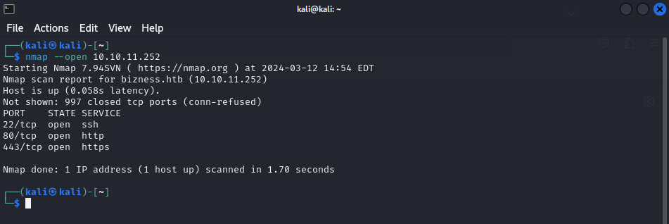

# Bizness

## Enumeration

We start with some basic nmap scan looking for open ports on the first 1000 ports.

```
nmap --open 10.10.11.252
```

<figure><figcaption><p>Nmap scan</p></figcaption></figure>

Here we can see an ssh and http services running.

Open 10.10.11.252 in browser, it will show the hostname after redirection.

Add the IP and hostname to /etc/hosts

```
sudo nano /etc/hosts
```

<figure><figcaption><p>Adding ip addres to /etc/hosts</p></figcaption></figure>

Now when we open the IP we enter the website.

<figure><figcaption><p>The website</p></figcaption></figure>

\
Lets perform directory enumeration using dirsearch.

```
dirsearch -u https://bizness.htb/ -e*
```

<figure><figcaption><p>Dir enumeration with dirsearch</p></figcaption></figure>

From here we see there is a login page  [**https://bizness.htb/control/login**](https://bizness.htb/control/login). Opening it we see it is using Apache OFBiz. Take notes of every information you gather so later you know what vulnerabilities to search for.

<figure><figcaption><p>Login Page</p></figcaption></figure>

***

## **Vulnerability Analysis**

We search the browser for CVE’s for Apache OFBiz.

<figure><figcaption></figcaption></figure>

And we find **CVE-2024-51467**.

This vulnerability not only exposes the ERP system to potential exploitation but also opens the door to a Server-Side Request Forgery (SSRF) exploit, presenting a dual threat to organizations relying on Apache OFBiz.

***

## **Exploitation**

I discovered a repository that enables us to exploit this vulnerability. :point\_down:



Clone it using git clone command, don’t forget to add `.git` on the end

```
git clone https://github.com/jakabakos/Apache-OFBiz-Authentication-Bypass.git
```

<figure><figcaption><p>Cloning git repo</p></figcaption></figure>

```
cd Apache-OFBiz-Authentication-Bypass
```

<figure><figcaption><p>Cd in the dir</p></figcaption></figure>

Once we have it, we want to execute the payload.

Start a netcat listener in a new terminal and than execute the payload in the first terminal.

<figure><figcaption><p>Executing the payload</p></figcaption></figure>

Looking back on our netcat listener we can see we got the reverse shell.

<figure><figcaption><p>Netcat terminal</p></figcaption></figure>


Upgrade the tty for easier navigation. If you dont know how to do that, check this page _<mark style="color:red;">(make the page and link up)</mark>_.


Searching around we find the user flag.

<details>

<summary>User Flag:</summary>

f62f6868b3151990af4621e3d506a999

</details>

***

## **Priviliege Escalation**

Searching around the files and gathering more information we come through a valuable file which contains a SHA-Hashed password.\


<figure><figcaption><p>SHA-Hashed passwor</p></figcaption></figure>

Before we use Hashcat for cracking the hash, let's first sanitize the data using [CyberChef](https://gchq.github.io/CyberChef/#recipe=Find_/_Replace\(%7B%27option%27:%27Regex%27,%27string%27:%27_%27%7D,%27/%27,false,false,false,false\)Find_/_Replace\(%7B%27option%27:%27Regex%27,%27string%27:%27-%27%7D,%27%2B%27,false,false,false,false\)From_Base64\(%27A-Za-z0-9%2B/%3D%27,false,false\)To_Hex\(%27None%27,0\)\&input=dVAwX1FhVkJwRFdGZW84LWRSekRxUndYUTJJ). This will reverse the encoding changes made by base64.urlsafe\_b64encode() and prepare it for hash analysis.\


<figure><figcaption><p>Data sanitization</p></figcaption></figure>

Now paste the output in hashcat with the following flags.

```
hashcat -m 120 -a 0 -d 1 "b8fd3f41a541a435857a8f3e751cc3a91c174362:d" /usr/share/wordlists/dirb/rockyou.txt
```

<figure><figcaption><p>Decryption</p></figcaption></figure>

And we got “monkeybizness” as the password.

Login as super user and get the flag.

Root flag:

<details>

<summary>Root Flag:</summary>

7b05c9ab49a63d33b676d2e6bdbe1895

</details>

***
