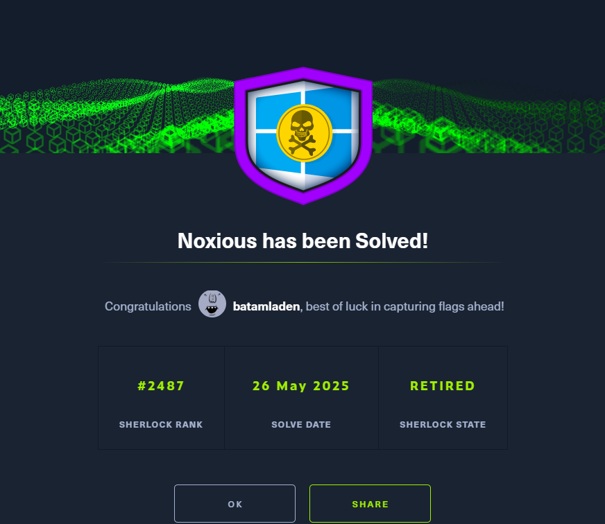

# Noxious

## Scenario

The IDS device alerted us to a possible rogue device in the internal Active Directory network. The Intrusion Detection System also indicated signs of LLMNR traffic, which is unusual. It is suspected that an LLMNR poisoning attack occurred. The LLMNR traffic was directed towards Forela-WKstn002, which has the IP address 172.17.79.136. A limited packet capture from the surrounding time is provided to you, our Network Forensics expert. Since this occurred in the Active Directory VLAN, it is suggested that we perform network threat hunting with the Active Directory attack vector in mind, specifically focusing on LLMNR poisoning.

***

## Tasks


1. Its suspected by the security team that there was a rogue device in Forela's internal network running responder tool to perform an LLMNR Poisoning attack. Please find the malicious IP Address of the machine.
2. What is the hostname of the rogue machine?
3. Now we need to confirm whether the attacker captured the user's hash and it is crackable!! What is the username whose hash was captured?
4. In NTLM traffic we can see that the victim credentials were relayed multiple times to the attacker's machine. When were the hashes captured the First time?
5. What was the typo made by the victim when navigating to the file share that caused his credentials to be leaked?
6. To get the actual credentials of the victim user we need to stitch together multiple values from the ntlm negotiation packets. What is the NTLM server challenge value?
7. Now doing something similar find the NTProofStr value.
8. To test the password complexity, try recovering the password from the information found from packet capture. This is a crucial step as this way we can find whether the attacker was able to crack this and how quickly.
9. Just to get more context surrounding the incident, what is the actual file share that the victim was trying to navigate to?

***

## Task 1

> Its suspected by the security team that there was a rogue device in Forela's internal network running responder tool to perform an LLMNR Poisoning attack. Please find the malicious IP Address of the machine.

Since its suspected that the attacker is using responder to perform a LLMNR Poisoning Attack - we will search for the LLMNR protocol and as our destination we will put the ip address of our Forela-WKstn002 workstation.

<figure><figcaption></figcaption></figure>

We have the rouge ip address that connected to our workstation.

<figure><figcaption></figcaption></figure>

answer: 172.17.79.135

***

## Task 2

> What is the hostname of the rogue machine?

Now looking at the IP address it is obviously a compromised machine from our network, so we will find the hostname of the now rouge machine.

We know that when DHCP protocol gives ip addresses to devices, in the Discover-Request-Acknowledge handshake, the DHCP saves the info of the name of the device it gives the ip address to.

Filter out DHCP and rouge machine ip address, the Request package holds the hostname info. Search in the details.

<figure><figcaption></figcaption></figure>

<figure><figcaption></figcaption></figure>

Answer: kali

***

## Task 3

> Now we need to confirm whether the attacker captured the user's hash and it is crackable!! What is the username whose hash was captured?


**NTLM** (NT LAN Manager) is a Windows authentication protocol used when a user tries to access a shared network resource. If an attacker runs a tool like _Responder_ and tricks the victim into connecting to their rogue device, the victim's NTLM hash can be captured.


To confirm whether the attacker captured a user's hash, we apply the filter `smb2` in Wireshark to inspect file-sharing traffic. Then, I searched for the string `NTLMSSP_AUTH`, which is part of the NTLM authentication process.

<figure><figcaption></figcaption></figure>

From the capture, we can see multiple `Session Setup Request` packets where the user `FORELA\john.deacon` was trying to authenticate. These attempts were intercepted and resulted in `STATUS_ACCESS_DENIED`, which confirms that the rogue machine captured the hash without completing authentication.

This shows that the user's credentials were indeed captured via NTLM authentication.

<figure><figcaption></figcaption></figure>

Answer: john.deacon

***

## Task 4

> In NTLM traffic we can see that the victim credentials were relayed multiple times to the attacker's machine. When were the hashes captured the First time?

To see the first attempt of capturing the hash, we dont change none of the searches applied, we already see them, but what we dont see is the time clearly.

Go in View -> Time Display Format and set the time to Y/M/D H/M/S.

<figure><figcaption></figcaption></figure>

Press on the "Time" column to order the events and there is our answer.

<figure><figcaption></figcaption></figure>

<figure><figcaption></figcaption></figure>

Answer: 2024-06-24 11:18:30

***

## Task 5

> What was the typo made by the victim when navigating to the file share that caused his credentials to be leaked?

To identify the typo that caused the victim’s credentials to be leaked, we inspect the SMB traffic. By filtering for SMB-related packets, we look for unusual file share access attempts. We notice that the victim tried to access a file share named `\\DCC01`, which is a typo of the actual domain controller `\\DC01`.

Since `DCC01` does not exist on the network, the system attempted to resolve it via DNS or NetBIOS and ended up connecting to a malicious SMB server controlled by the attacker. This mistake caused the victim’s system to send an NTLM authentication attempt to the attacker's machine, allowing the attacker to capture the credentials.

<figure><figcaption></figcaption></figure>

<figure><figcaption></figcaption></figure>

Answer: DCC01

***

## Task 6

> To get the actual credentials of the victim user we need to stitch together multiple values from the ntlm negotiation packets. What is the NTLM server challenge value?

We use the hint for this one:

<figure><figcaption></figcaption></figure>


We apply the filter `ntlmssp` to isolate NTLM-related packets. Then, to specifically locate the NTLM challenge, we search for `NTLMSSP_CHALLENGE` packets.

Packet number **9291** contains the `NTLMSSP_CHALLENGE` message. This is the response from the SMB server after the initial negotiate request from the client.

In the packet details under the `NTLMSSP Challenge` structure, we find the `NTLM Server Challenge` field.

<figure><figcaption></figcaption></figure>

<figure><figcaption></figcaption></figure>

Answer: 601019d191f054f1

_This 8-byte value is essential for reconstructing the NTLMv2 hash and performing offline password cracking._

***

## Task 7

> Now doing something similar find the NTProofStr value.

We do the same but we search in the NTLMSSP\_AUTH and search in details for NTProofStr

<figure><figcaption></figcaption></figure>

<figure><figcaption></figcaption></figure>

Answer: c0cc803a6d9fb5a9082253a04dbd4cd4

***

## Task 8

> To test the password complexity, try recovering the password from the information found from packet capture. This is a crucial step as this way we can find whether the attacker was able to crack this and how quickly.

Add the following info in a text note and run it with hashcat.

User::Domain:ServerChallenge:NTProofStr:NTLMv2Response(without first 16 bytes).

The NTLMv2 Response value can be found from where we found NTProofStr. Remove the first 16 bytes(32 characters) from the value.

<figure><figcaption></figcaption></figure>

```
Hashcat -a0 -m5600 hashfile.txt rockyouwordlist.txt
```

<figure><figcaption></figcaption></figure>

<figure><figcaption></figcaption></figure>

Answer: NotMyPassword0K?

***

## Task 9

> Just to get more context surrounding the incident, what is the actual file share that the victim was trying to navigate to?

To determine the actual file share the victim intended to access, we analyze the SMB traffic since we know its the protocol used for file shares. Specifically, we look for the original and legitimate file share name used by the victim’s system.

When a user acceses a share there is a `Tree Connected/Disconnected Request`\
Just search with the legit ip addres and browser for the tree info.


<figure><figcaption></figcaption></figure>

<figure><figcaption></figcaption></figure>

Answer: \DC01\DC-Confidential

***

## Completion

<figure><figcaption></figcaption></figure>
