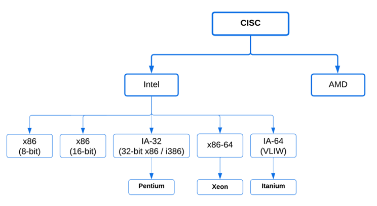

# Basic Concepts

## Programming Languages

<figure><figcaption></figcaption></figure>

Types of programming languages:

* Imperative - **Imperative Languages**: These languages are about giving direct instructions to the computer on _how_ to achieve a result, step by step. Imagine following a recipe—imperative languages tell the computer exactly what to do in each step, often using things like variables (for storing data) and loops (for repeating actions). Examples include C and Java.
* Declarative - Instead of giving step-by-step instructions, these languages describe _what the end result should look like_, without specifying how to get there. In a way, it's like telling someone the destination without giving them the directions. Examples of this are **logical programming languages** (such as Prolog and SQL), where you define facts and rules, and the system figures out how to use them to solve problems.

***

## Algorithms

An algorithm is a list of instructions that are applied to solve problems or various tasks. If we have an algorithm for solving a task, a programming language can be used to implement it.

<mark style="background-color:yellow;">Algorythms ane programs, and vice versa - every program is an algorythm.</mark>

We use block schemas to describe and algorythm, that consits of start block, end block, decision block, action block, input and output block.

<figure><figcaption></figcaption></figure>

***

## Translators

A translator is a program used to convert the source code into object code (machine understandable code).

<mark style="color:yellow;">Assembler</mark> translates the assembly language into object code. Assembly is a low-level programming language. In assemblt the intructions that are used are the instructions provided by the processor instruction set.

<mark style="color:yellow;">The interprete</mark>r translates the program (source code) into object code, but one instruction at a time. The program is executed line by line sequentially.

<mark style="color:yellow;">The compiler</mark> takes the program (source code) as a whole and translates it into object code all at once. This process is called compilation. Once converted, the object code can be run at any time. The action it performs to create an executable file from the object file is called a link, and the program that performs this action is called a linker. For a compiled program and already linked program to be executed, we do not need to have a compiler at runtime.

***

## Positional Number Systems

* Binary - 0, 1
* Octal - 0, 1, 2, 3, 4, 5, 6, 7
* Decimal - 0, 1, 2, 3, 4, 5, 6, 7, 8, 9
* Hexidecimal - 0, 1, 2, 3, 4, 5, 6, 7, 8, 9, a, b, c, d, e, f

<figure><figcaption></figcaption></figure>

#### Binary Coded Decimal

fore example:\
1 in decimal is 0001 in binary \
2 is 0010 \
3 is 0011 \
4 is 0100 ...

***

## Computer Architecture

Types of **computer architectures**—the way computers are structured to perform tasks.

1. **According to the Word Length**: The term _"word"_ as a term in microprocessor technology represents the amount of information that a processor's general purpose data register can process simultaneously. Its length is measured in bits.

8-bit architectures (Motorola 6800, 1974; Intel 8080, 1974; …) 16-bit architectures (Intel 8086 1976; Intel 80286 …) 32-bit architectures (Motorola 68000, 1979; Intel 80386, 80486 (1989) …) 64-bit architectures (Intel 80486 -> Pentium …)

2. **According to the Processor Architecture**: This refers to how a processor’s instructions (commands it can execute) are designed and organized. There are a few key types:

* **CISC (Complex Instruction Set Computer)**: CISC processors have a large set of complex instructions. Each instruction can perform multiple operations, which can make programming simpler but may require more processing power and time for each instruction.
* **RISC (Reduced Instruction Set Computer)**: RISC processors use a smaller, simpler set of instructions, each designed to execute very quickly. This simplicity helps RISC processors perform tasks faster, as they complete each instruction in just one or a few cycles.
* **ARM (Advanced RISC Machine)**: ARM is a specific type of RISC architecture known for its power efficiency and is widely used in mobile devices like smartphones and tablets.

!\[\[CISC.png]]

<figure><figcaption></figcaption></figure>

!\[\[RISC.png]]

<figure><figcaption></figcaption></figure>

!\[\[ARM.png]]

3. **According to the Organization of Memory**: This category looks at how data is stored in memory, particularly how the bytes are ordered in multi-byte data types (like integers or floating points).

* **Big Endian**: In this system, the most significant byte (the “big end”) is stored first in memory. For example, in a 4-byte number, the byte with the highest value is at the lowest memory address. Big - highest, End - last value (last value at top)
* **Little Endian**: Here, the least significant byte (the “little end”) is stored first. This means the byte with the lowest value is at the lowest memory address. Little - lowest, End - last value (last value at lowest)
* **Bi-endianness**: Some systems are _bi-endian_, meaning they can switch between Big Endian and Little Endian modes depending on the situation, making them more flexible for compatibility.

***

## CPU Clock Speed

CPU clock speed is the number of cycles a CPU performs per second. Measured in GHz, and it determines how quickly a CPU can execute instructions.

!\[\[CPU clock.png]]

***

## Introduction To Assembly Programming

Assembly language is a low-level programming language, specific to a computer architecture.

❑ Assembly language provides a human-readable representation of the machine code or binary code that a computer's central processing unit (CPU) can execute.&#x20;

❑ It serves as a bridge between high-level programming languages and the binary machine code that a computer's CPU understands.&#x20;

❑ Assembly language is often used in situations where precise control over hardware and performance optimization are critical.&#x20;

❑ It is commonly used for developing device drivers, firmware, embedded systems, and certain system-level programming tasks.&#x20;

❑ Assembly language programming can be complex and less accessible than highlevel programming languages.

### Key Characteristics

* Represents a symbolic representation of machine code (mov, add, …).
* **Low-level language** - it operates at a level very close to the computer's hardware. Each assembly language instruction corresponds to a specific machine-level operation.
* **Provides direct access to a computer's hardware** - Assembly language allows programmers to have precise control over a computer's hardware. It can directly interact with registers, memory, and input/output devices.
* **Specific to CPU Architecture** - Assembly language is specific to the architecture of a particular CPU or microprocessor. Different CPUs have their own assembly languages, and code written for one CPU may not be compatible with another.
* **Efficiency** - assembly programs can be highly efficient and fast (they provide a level of control and optimization not easily achieved in high-level languages).
* **Limited Abstraction** - assembly language provides a minimal level of abstraction, making it a powerful choice for system-level programming, embedded systems, and tasks that require direct manipulation of hardware.
* **Assembler** - to convert human-readable assembly code into machine code, an assembler is used. The assembler translates assembly language instructions into binary machine code.
* **Registers and Memory** - assembly language typically involves the use of CPU registers for temporary storage and memory for data and program storage. Instructions specify how data is moved between registers and memory.

### Components

Instructions -> Mnemonics for basic operations (e.g., MOV, ADD, JMP) Registry -> Small, fast storage locations within the CPU Memory Addressing -> How data is accessed in memory Flow Control .-> Loops and branching instructions

***

## Key take-outs

There are different CPU architectures – 8-bit, 16-bit, 32-bit, and etc. Every CPU has its own clock speed. Every CPU has its own instruction set. Some architectures provide simple and fast instructions Some architectures provide complicated and slow fast instructions. Assembly language is a low level programming language.
